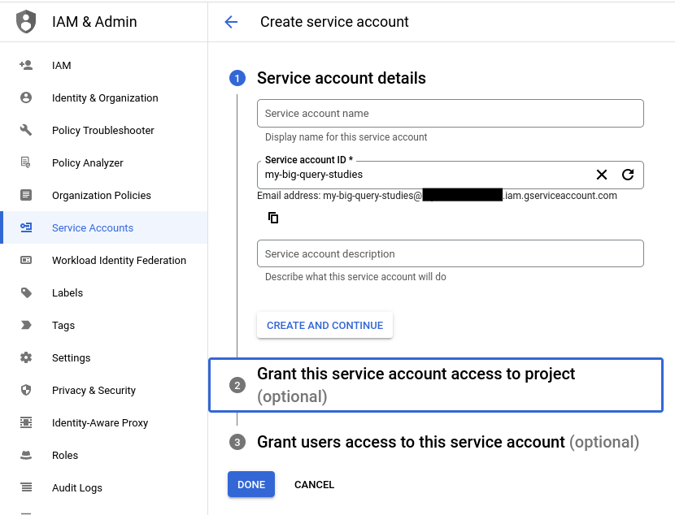
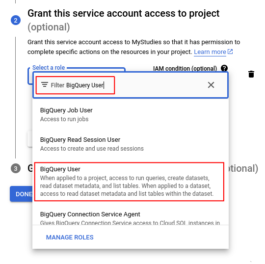
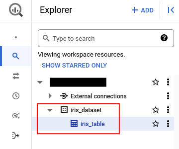
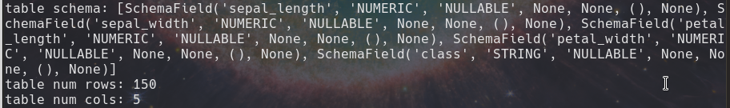

# Big Query Demo

A demo using [Big Query](https://cloud.google.com/bigquery/docs) of Google Cloud for injection and loading data.

# Set-up

## Python Environment

- Create a new environment using your prefer environment manager and activate it:
 
```bash
$ python3 -m venv .venv
$ source .venv/bin/activate  # unix
```

- Install the dependencies:

```bash
$ pip install -r requirements.txt
```

## Service Account

You need a [Service Account](https://cloud.google.com/iam/docs/service-account-overview) to create and use Big Query API. To create one, go to your project and access `IAM & Admin` &rarr; `Services Accounts` &rarr; `Create service account`



Click on `Create and Continue` and select the role `BigQuery User` and click on `Done`



When you finished, you don't have any keys. Click on in your Service Account created before and go to the tab `Keys`. Click on `Add Key` &rarr; `Create new key` &rarr; `JSON` &rarr; `Create` and save in a safe place (NOTE: This key is responsible for accessing cloud resources...). I save my key in my system on `/home/brenoav/gcp/credentials/key.json`, feel free to choose other paths, but remember not include in your version control software (git) because it's a secret!!.


**Alternative:** You can do this using the [Cloud Shell](https://cloud.google.com/shell) instead of using the Graphical Interface. You can find the tutorial here: [Authenticate API requests](https://codelabs.developers.google.com/codelabs/cloud-bigquery-python#3) and [Set up access control](https://codelabs.developers.google.com/codelabs/cloud-bigquery-python#4)

## Credentials Environment Variable

Set up your credential environment variable. I'm using a Unix system, then I ran in my terminal:

```bash
export GOOGLE_APPLICATION_CREDENTIALS=/home/${USER}/gcp/credentials/<key_name>.json
```

If you use Windows, you can find [here](https://learn.microsoft.com/en-us/windows-server/administration/windows-commands/set_1) how to create an environment variable.

# Running the Big Query Client

## Save from local to the Big Query

The first script is [save_csv_in_bigquery.py](./save_csv_in_bigquery.py) that download the [Iris dataset](https://en.wikipedia.org/wiki/Iris_flower_data_set), loads in a pandas' data frame and saves the `pd.DataFrame` in the Big Query (Injection) creating a dataset and table. If you access `BigQuery` in `Google Cloud Console` you can see the dataset/table created:

```bash
$ python save_csv_in_bigquery.py
```



## Load from Big Query

The second script is [load_table_bigquery.py](./load_table_bigquery.py) that accesses the dataset and table uploaded on the BigQuery and print some outputs:

```bash
$ python load_table_bigquery.py
```



---

<div align="center">
  <strong>"People’s dreams... Have no ends" - OP</strong>
</div>

<p align="center">
  <sub>Created by BrenoAV</sub>
</p>